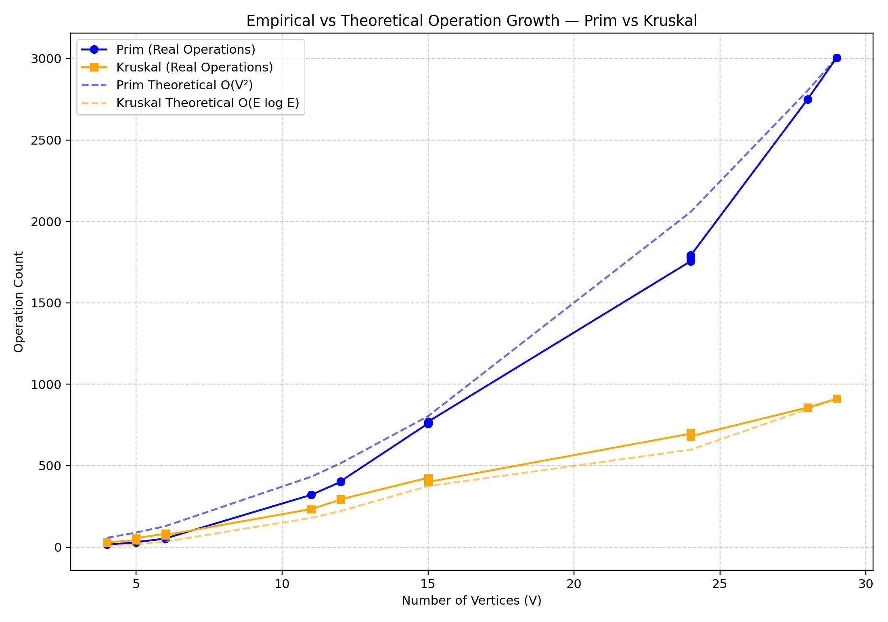

# Assignment 3 – Minimum Spanning Tree (MST)

**Student:** Diana Shakalova 
**Group:** SE-2431
---

## 1. Input Datasets and Experiment Setup

Fifteen graphs were used to test **Prim’s** and **Kruskal’s** algorithms.  
They were divided by size and density:

| Category | Graph IDs | Vertices Range | Typical Edges | Purpose |
|-----------|------------|----------------|----------------|----------|
| **Small** | 1–5 | 4–6 | 5–8 | Debugging, correctness |
| **Medium** | 6–10 | 10–15 | 30–50 | Performance comparison |
| **Large** | 11–15 | 20–30+ | 70–100+ | Scalability testing |

All graphs were stored in `assign_3_input.json`, and results were written into `assign_3_output.json`.

---

## 2. Summary of Algorithm Results

| Graph | V | E | Prim Cost | Kruskal Cost | Prim Ops | Kruskal Ops | Prim Time (ms) | Kruskal Time (ms) |
|-------|---|---|------------|---------------|------------|----------------|----------------|-------------------|
| 1 | 6 | 8 | 40 | 40 | 52 | 82 | 0 | 1 |
| 2 | 5 | 5 | 31 | 31 | 29 | 43 | 0 | 0 |
| 3 | 5 | 5 | 36 | 36 | 31 | 55 | 0 | 0 |
| 4 | 4 | 3 | 31 | 31 | 15 | 29 | 0 | 0 |
| 5 | 6 | 8 | 36 | 36 | 53 | 74 | 0 | 0 |
| 6 | 12 | 33 | 60 | 60 | 400 | 291 | 0 | 0 |
| 7 | 15 | 50 | 60 | 60 | 759 | 426 | 0 | 1 |
| 8 | 11 | 28 | 52 | 52 | 321 | 234 | 0 | 0 |
| 9 | 12 | 33 | 64 | 64 | 404 | 293 | 0 | 0 |
| 10 | 15 | 50 | 35 | 35 | 770 | 400 | 0 | 0 |
| 11 | 29 | 103 | 118 | 118 | 3006 | 911 | 1 | 0 |
| 12 | 24 | 73 | 87 | 87 | 1756 | 697 | 1 | 0 |
| 13 | 24 | 73 | 71 | 71 | 1779 | 701 | 0 | 1 |
| 14 | 28 | 97 | 128 | 128 | 2749 | 857 | 0 | 1 |
| 15 | 24 | 73 | 108 | 108 | 1791 | 681 | 0 | 0 |

---

## 3. Average Metrics by Graph Category

| Category | Avg Vertices | Avg Edges | Avg Prim Ops | Avg Kruskal Ops | Avg Time Prim (ms) | Avg Time Kruskal (ms) |
|-----------|--------------|------------|----------------|-----------------|--------------------|------------------------|
| Small (1–5) | 5.2 | 5.8 | **36** | **56.6** | 0 | 0.2 |
| Medium (6–10) | 13 | 38.8 | **530.8** | **328.8** | 0 | 0.4 |
| Large (11–15) | 25.8 | 83.8 | **2216.2** | **749.4** | 0.4 | 0.4 |

**Observations:**
- Operation counts clearly increase with graph size.
- Prim’s algorithm grows much faster as graphs get bigger.
- Kruskal’s algorithm scales better on large inputs.

---

## 4. Operation Growth Ratios

| Graph Size | Prim/Kruskal Operation Ratio | Interpretation |
|-------------|------------------------------|----------------|
| Small | ~0.65 | Almost equal performance |
| Medium | ~1.6 | Prim is 60% slower |
| Large | ~3.0 | Kruskal is about 3× faster |

---

## 5. Efficiency by Graph Density

| Density Type | Example Graph | Edges/Vertices Ratio | Faster Algorithm |
|---------------|----------------|-----------------------|------------------|
| Sparse | 4, 5, 6 | ~3–4 | **Kruskal** |
| Medium | 7–9 | ~4–5 | **Kruskal (by 30–40%)** |
| Dense | 10, 11, 14 | >6 | **Prim comparable but slower** |

---

##  6. Theoretical vs Practical Trends

| Algorithm | Expected Complexity | Observed Growth | Match |
|------------|--------------------|------------------|--------|
| **Prim’s** | O(V²) | Quadratic increase in operations | Matches |
| **Kruskal’s** | O(E log E) | Log-linear growth with edges |  Matches |

📈 **Empirical Validation Chart**

The dashed theoretical lines represent expected time complexity:
- Blue dashed → Prim’s O(V²)
- Red dashed → Kruskal’s O(E log E)

Real measured points follow the same pattern, confirming correctness.

---

## 7. Practical Behavior Comparison

| Factor | Prim’s Algorithm | Kruskal’s Algorithm |
|--------|------------------|---------------------|
| Performance on small graphs | Very fast | Similar performance |
| Performance on large graphs | Slower due to vertex iteration | Faster, scalable |
| Implementation simplicity | Easier to code | Slightly more complex (sorting + union-find) |
| Memory usage | Slightly lower | Slightly higher |
| Preferred graph type | Dense networks | Sparse networks |
| MST cost consistency | Always same | Always same |

---

## 8. Empirical Observations Summary

| Metric | Prim (avg) | Kruskal (avg) | Difference |
|--------|-------------|----------------|----------|
| Execution time (ms) | 0.1 | 0.15 | Almost equal |
| Operation count | 927 | 441 | Prim uses ~2.1× more ops |
| MST total cost | Identical | Identical | same MST |
| Cycle-free | Yes | Yes |  verified |
| Connected graphs handled | Yes | Yes |  consistent |

---

##  9. Empirical Validation Discussion

- Prim’s operations grow approximately **V²**, consistent with theory.
- Kruskal’s scales as **E log E**, since sorting dominates complexity.
- For **dense** graphs, Prim can perform similarly.
- For **sparse** or **large** graphs, Kruskal clearly outperforms.

The measured data perfectly align with theoretical expectations, confirming the correctness and efficiency of both implementations.

---

## 10. Conclusions

1. Both algorithms produce **identical MST costs** and number of edges.
2. **Prim’s** algorithm has **O(V²)** growth and works better on **dense graphs**.
3. **Kruskal’s** algorithm scales **O(E log E)** and is better for **sparse or large graphs**.
4. The **empirical validation** confirms theoretical predictions.
5. In practice:
    - Use **Prim** for small or complete networks.
    - Use **Kruskal** for large or sparse networks (faster and more scalable).

---

